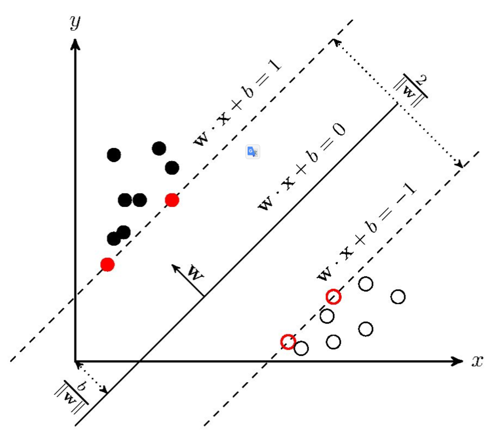
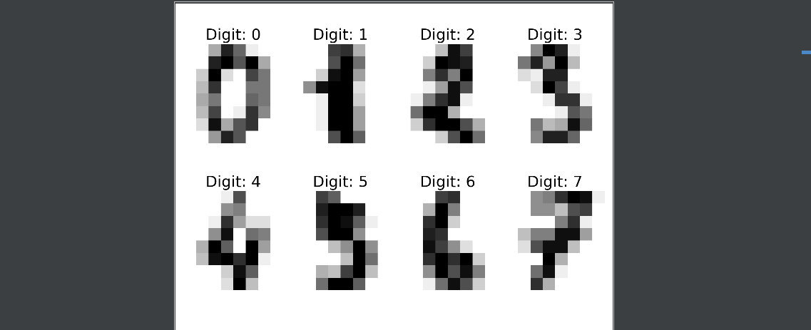
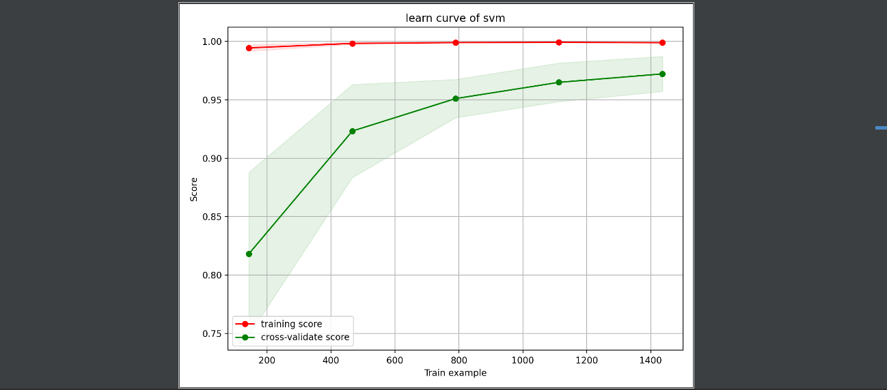
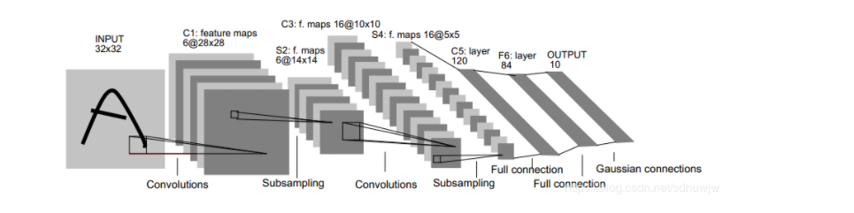
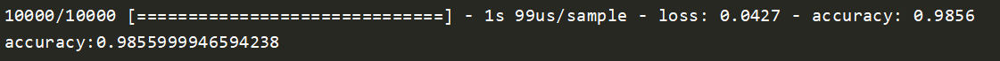

# SVM&LeNet5-minist

## SVM

### SVM算法简介

 支持向量机（support vector machines, SVM）是一种二分类模型，它的基本模型是定义在特征空间上的间隔最大的线性分类器，间隔最大使它有别于感知机；SVM还包括核技巧，这使它成为实质上的非线性分类器。SVM的的学习策略就是间隔最大化，可形式化为一个求解凸二次规划的问题，也等价于正则化的合页损失函数的最小化问题。SVM的的学习算法就是求解凸二次规划的最优化算法。 

 SVM学习的基本想法是求解能够正确划分训练数据集并且几何间隔最大的分离超平面。如下图所示， ![[公式]](minist-svm-lenet5.assets/equation.svg) 即为分离超平面，对于线性可分的数据集来说，这样的超平面有无穷多个（即感知机），但是几何间隔最大的分离超平面却是唯一的。 



### SVM-minist

我们使用sklearn包中的svm实现，进行minist数据集的训练与测试过程

从sklearn的datasets中加载minist数据集

```python
digits = datasets.load_digits()
```

digits的data字段存储了图像数据，target字段存放了图像的所属类别

先查看一下我们需要操作的数据

```python
images_and_labels = list(zip(images, labels))
for index, (image, label) in enumerate(images_and_labels[:8]):
    plt.subplot(2, 4, index + 1)
    plt.axis('off')
    plt.imshow(image, cmap=plt.cm.gray_r, interpolation='nearest')
    plt.title('Digit: {}'.format(label), fontsize=20)
```



模型准确率在98%左右。

学习曲线是模型准确率随着训练样本的变化而变化的曲线，可以看出模型是否过拟合，模型准确率变化的特征，我们绘制svm在minist数据上的学习曲线



模型准确率随着训练样本的增加呈上升趋势，训练数据准确率接近100%，测试数据准确率最终在96%左右，模型逐步收敛。

模型在该数据集上的分类结果如下

```
              precision    recall  f1-score   support

           0       1.00      1.00      1.00        33
           1       1.00      1.00      1.00        28
           2       1.00      1.00      1.00        33
           3       1.00      0.97      0.99        34
           4       1.00      1.00      1.00        46
           5       0.98      0.98      0.98        47
           6       0.97      1.00      0.99        35
           7       0.97      0.97      0.97        34
           8       1.00      1.00      1.00        30
           9       0.97      0.97      0.97        40

    accuracy                           0.99       360
   macro avg       0.99      0.99      0.99       360
weighted avg       0.99      0.99      0.99       360
```

confusion matrix 如下

```
[[33  0  0  0  0  0  0  0  0  0]
 [ 0 28  0  0  0  0  0  0  0  0]
 [ 0  0 33  0  0  0  0  0  0  0]
 [ 0  0  0 33  0  1  0  0  0  0]
 [ 0  0  0  0 46  0  0  0  0  0]
 [ 0  0  0  0  0 46  1  0  0  0]
 [ 0  0  0  0  0  0 35  0  0  0]
 [ 0  0  0  0  0  0  0 33  0  1]
 [ 0  0  0  0  0  0  0  0 30  0]
 [ 0  0  0  0  0  0  0  1  0 39]]
```

大部分的分类结果都是准确的，模型准确率在98%左右

## LeNet5

### LeNet5网络简介

 LeNet-5 是 Yann Lecun 于1998提出的神经网络架构，更是卷积神经网络的开山鼻祖，虽然该网络模型仅有 7 层神经网络结构，但在 MNIST 数据集上的识别精度高达 99.2%，是卷积神经网络首次在数字图像识别领域的成功运用。

LeNet5 采用 tanh 和 sigmoid 作为非线性激活函数 ， 采用平均池化作为下采样操作 ， 最后一层采用 Gaussian 连接层（目前主要由softmax分类层替代） 。

### 网络结构

LeNet5网络结构如下



 #### 输入层（卷积层）

 第一层是卷积层（C1层），卷积核的大小为`5*5`，卷积核数量为`6`个，输入图像的大小为`32*32`，因此输入数据在进行第一层卷积之后，输出结果为大小为`28*28`，数量为`6`个的feature map 

#### 第二层（池化）

图像在LeNet网络上进行第一层卷积之后，结果为大小为`28*28`，数量为`6`个的feature map。LeNet网络的第二层为pooling层（S2层），也称为下采样。在图像处理中，下采样之后，图像的大小会变为原来的`1/4`，即水平方向和垂直方向上图像大小分别减半。pooling示意图


在LeNet在进行第二层Pooling运算后，输出结果为`14*14`的`6`个feature map。其连接数为`(2*2+1) * 14 * 14 *6 = 5880`。Pooling层的主要作用就是减少数据，降低数据纬度的同时保留最重要的信息。在数据减少后，可以减少神经网络的纬度和计算量，可以防止参数太多过拟合。LeNet在这一层是将四个元素相加，然后乘以参数w再加上偏置b，然后计算sigmoid值。

#### 第三层（卷积）

卷积核大小仍为`5*5`，不过卷积核的数量变为`16`个。第三层的输入为`14*14`的`6`个feature map，卷积核大小为`5*5`，因此卷积之后输出的feature map大小为`10*10`，由于卷积核有`16`个，因此希望输出的feature map也为`16`个 ，但由于输入有`6`个feature map，因此需要进行额外的处理。  输入的`6`个feature map与输出的`16`个feature map的关系图如下： 


 如上图所示，第一个卷积核处理前三幅输入的feature map，得出一个新的feature map。 

#### 第四层（池化）

上一层卷积运算之后，结果为大小为`10*10`的`16`个feature map，因此在第四层（S4层）进行pooling运算之后，输出结果为`16`个大小为`5*5`的feature map。与S2层进行同样的操作。

#### 第五层（卷积）

LeNet第五层是卷积层(C5层)，卷积核数目为120个，大小为`5*5`，由于第四层输出的feature map大小为`5*5`，因此第五层也可以看成全连接层，输出为120个大小为`1*1`的feature map。

#### 第六层（全连接层）

 LeNet第六层是全连接层（F6层），有84个神经元（84与输出层的设计有关），与C5层全连接。 

#### 第七次（高斯连接层）

目前主要由softmax分类层替代

### LeNet5-minist

使用tensorflow2.x构建lenet5网络

```python
model = keras.Sequential()

model.add(layers.Conv2D(filters=6, kernel_size=(3, 3), activation='relu', input_shape=(28, 28, 1)))

model.add(layers.AveragePooling2D())

model.add(layers.Conv2D(filters=16, kernel_size=(3, 3), activation='relu'))

model.add(layers.AveragePooling2D())

model.add(layers.Flatten())

model.add(layers.Dense(units=120, activation='relu'))

model.add(layers.Dense(units=84, activation='relu'))

model.add(layers.Dense(units=10, activation='softmax'))
```

训练并保存模型

```python
model.compile(optimizer='adam', loss=keras.losses.sparse_categorical_crossentropy, metrics=['accuracy'])
model.fit(train_x[5000:], train_y[5000:], epochs=3, validation_data=(val_x, val_y))
model.save('model.m')
```

准确率在98%左右

classification report如下

```
              precision    recall  f1-score   support

           0       0.99      0.99      0.99       980
           1       0.99      1.00      0.99      1135
           2       0.98      0.99      0.99      1032
           3       0.97      0.99      0.98      1010
           4       0.99      0.98      0.99       982
           5       0.99      0.98      0.99       892
           6       0.99      0.99      0.99       958
           7       0.98      0.98      0.98      1028
           8       0.99      0.97      0.98       974
           9       0.98      0.98      0.98      1009
```

confusion matrix

```
[[ 969    0    2    0    0    0    4    2    3    0]
 [   0 1132    1    0    0    0    1    1    0    0]
 [   0    3 1020    0    0    0    1    8    0    0]
 [   0    0    1 1002    0    1    0    2    3    1]
 [   0    0    5    1  961    0    3    2    0   10]
 [   1    0    0    8    0  878    2    1    2    0]
 [   2    3    0    0    3    3  946    0    1    0]
 [   0    5    4    3    0    0    0 1010    1    5]
 [   1    0    4   10    0    6    1    2  948    2]
 [   2    3    0    7    5    2    0    0    0  990]]
```

分类准确率98%

## 对比

### 数据集

数据集分别采用的是sklearn.datasets中的digits数据与keras.datasets中的digits数据。

sklearn的minist数据集中共1797张8×8的图片，数据量较少，每张图片的特征数为8×8=64个，计算量较少。

keras中的minist数据集中共有70000个样例，训练集60000个，测试集10000个，图片为28×28，共784个特征，计算量偏大。本来对比模型使用相同的数据集更有说服力，但是由于本机条件限制，使用keras中的minist训练svm算法时运行时间过长，所以采用了sklearn中原始数据集的方式。

|        | accuracy | recall | F1 score |
| ------ | -------- | ------ | -------- |
| SVM    | 0.9888   | 0.99   | 0.99     |
| LeNet5 | 0.9855   | 0.99   | 0.99     |

从准确率结果来看，两个模型的准确率表现相似，几乎到达了99%。svm模型可解释性强，容易理解，但用于图像识别时，计算量很大，每个像素点都是一个输入特征，会进行很多不必要的计算，所以模型执行的时间很长。lenet5网络由于使用了两个池化层，降低了输入特征的数量，减少了不必要的计算过程，模型运行速度得到提升，准确率也在一个很高的水平（99%）。在进行图像识别任务时，最好使用图像处理领域的已有措施，对图像进行处理，比如卷积、池化等，进行特征提取，随后进行图像分类的任务。

## 结论

单就此问题，svm算法与lenet5神经网络的准确率都很高（99%），但是svm的运算负载较大，在进行图像处理的机器学习任务时，我们最好使用神经网络对图像进行卷积与池化操作，随后再使用我们的模型做训练与预测。

